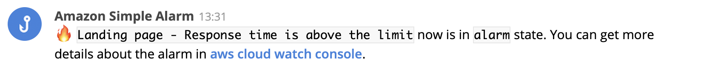

1. Build the lambda source code with `npm run build`.
2. Deploy the lambda source code with `npm run deploy`.
3. Go to the aws cloud formation stack.
4. Change desired options for the stack.
5. Subscribe for new events on a desired arn with the deployed lambda.

# List of executed deployments
```bash
AWS_PROFILE=production AWS_REGION=us-east-1 NAME=simple-notifications-fire-alarm-to-fleep-webhook NODE_ENV=production npm run deploy
AWS_PROFILE=production AWS_REGION=us-west-2 NAME=simple-notifications-fire-alarm-to-fleep-webhook NODE_ENV=production npm run deploy
```

# Simple notifications alarm to fleep webhook
This stack is used to subscribe for [AWS CloudWatch](https://console.aws.amazon.com/cloudwatch/home) alarms via [AWS SNS](https://console.aws.amazon.com/sns/home) topics.
Every notification will be published to [Fleep](https://fleep.io/) channel via [Fleep Webhook](https://fleep.io/blog/integrations/webhooks/) integration.
Message template is fully customizable.

**Supported message template variables**

You can customize message content format which will be published to a channel.
The default message template has everything needed and human-readable format.

```bash
${marker} *${title}* now is in `${state}` state. You can get more details about the alarm in ${url}<<aws cloud watch console>>.
```



|Code|Usage|Description|
|----|-----|-----------|
|`arn`|`${arn}`|Internal notification amazon resource name.|
|`state`|`${state}`|Alarm state: `insufficient`, `alarm` or `ok`.|
|`marker`|`${marker}`|Alarm marker based on alarm state: `⚠`, `🔥` or `✅`.|
|`title`|`${title}`|Alarm name from cloud watch console.|
|`description`|`${description}`|Alarm description from cloud watch console.|
|`url`|`${url}`|Alarm url to cloud watch console with particular alarm.|
