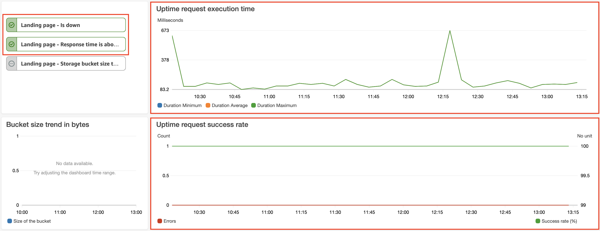

This stack helps to implement website monitoring with `up` and `down` states and execution time metric.
You are able to setup alerts for this metrics.




1. Build the lambda source code with `npm run build`.
2. Deploy the lambda source code with `npm run deploy`.
3. Go to the aws cloud formation stack.
4. Change desired options for the stack.
5. Subscribe for new events on a desired arn with the deployed lambda.

# List of executed deployments
```bash
AWS_PROFILE=production AWS_REGION=us-east-1 NAME=core-api-website-uptime-monitor NODE_ENV=production npm run deploy
AWS_PROFILE=production AWS_REGION=us-east-1 NAME=web-application-website-uptime-monitor NODE_ENV=production npm run deploy
AWS_PROFILE=production AWS_REGION=us-east-1 NAME=landing-page-website-uptime-monitor NODE_ENV=production npm run deploy
AWS_PROFILE=production AWS_REGION=us-east-1 NAME=matomo-analytics-website-uptime-monitor NODE_ENV=production npm run deploy
```
